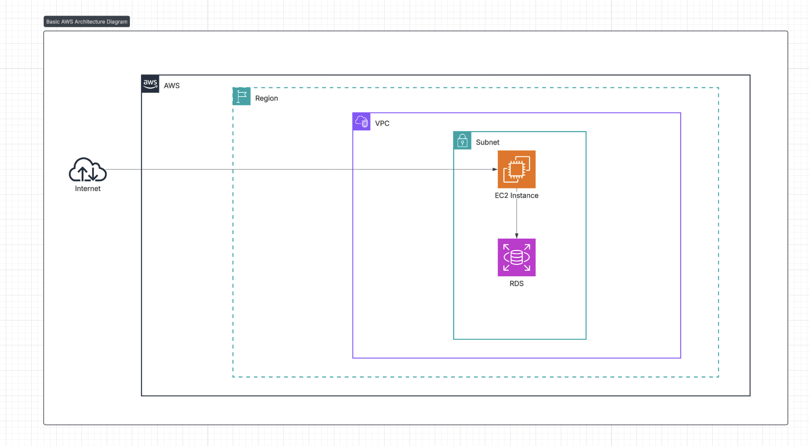

# Edulance

## Overview
This document outlines the key features, requirements, and data flow of **Edulance**.  
The platform enables users to create or join hackathons and group projects.  
Each user can securely log in, post collaboration opportunities, and find teammates based on relevant skills and project requirements.

---

## Core Features

### Authentication
If a user is not registered, they can create an account by providing a **username**, **email**, and **password**.  
After registration, a verification email is sent to the provided email address.  
Once the user verifies their email, the account becomes active, allowing them to access the platform.

If the user is already registered, they can log in using their credentials.  
Upon successful authentication, they are redirected to the **Home Page**.  
If the credentials are invalid, an error message prompts them to re-enter their information.

---

### Authorization
Authorization in **Edulance** is role-based, granting different permissions to **Admins** and **Users**.

#### Admin Capabilities
- Can see all the users and posts  
- Can remove any user  
- Can remove any post  

#### User Capabilities
- Can create, update, or delete their own posts  
- Can join available posts created by others  
- Can view applicants for their posts  

---

### Data Flow Diagram

---
## In Scope

- **Account Management:** Users can register and log in securely.  
- **Authentication and Authorization:** JWT-based authentication with role-based access control (Admin and User roles).  
- **Post Creation and Management:** Users can create, update, and delete posts for hackathons or group projects, specifying participants required, description, skills, and application deadline.  
- **Skill Tagging:** Posts allow tagging multiple skills to attract suitable applicants.  
- **Application System:** Authenticated users can apply to available posts.  
- **Admin Management:** Admins can delete users and posts.  
- **Progressive Web App (PWA):** Fully implemented PWA providing an app-like experience, offline support, and improved performance.  
- **AWS EC2 Deployment:** Application successfully deployed on AWS EC2 with environment configuration and server setup.  
- **CI/CD Pipeline:** Complete GitHub Actions CI/CD pipeline implemented, including automated testing, security scanning (Trivy), and deployment to EC2.

---

## Out of Scope

- Forgot Password feature  
- Rejecting or approving applications (no status tracking)  
- Sending direct messages or notifications between users  
- Commenting or asking questions on posts  
- Team creation and management after application acceptance  

---

## Requirements

### Functional Requirements

1. **User Authentication:** Users should be able to register, log in, and authenticate using JWT tokens.  
2. **Email Verification:** Upon registration, users must verify their email before accessing the platform.  
3. **Role-Based Access:** Admins have elevated permissions to manage users, and posts.  
4. **Post Creation:** Authenticated users can create posts for hackathons or group projects.  
5. **Application Submission:** Authenticated users can apply to open posts.  

---

### Technical Requirements

#### Backend
- **Framework:** Django(5.2.8) with Django REST Framework(3.16.1) for REST APIs  
- **Language:** Python(3.12)  
- **Authentication:** JWT-based authentication with email verification  
- **Email Verification:** Implemented via Django’s email backend to send verification links to users during registration  
- **Database:** PostgreSQL(14.19)  
- **Validation:** Model and serializer-level input validation  
- **Testing:** Pytest(9.0.0) for backend testing  
- **Environment Management:** `uv` for virtual environment and dependency management  

#### Frontend
- **Technologies:** HTML, CSS, JavaScript  
- **Framework:** Bootstrap  

### Schema Diagram

### Architecture Diagram
